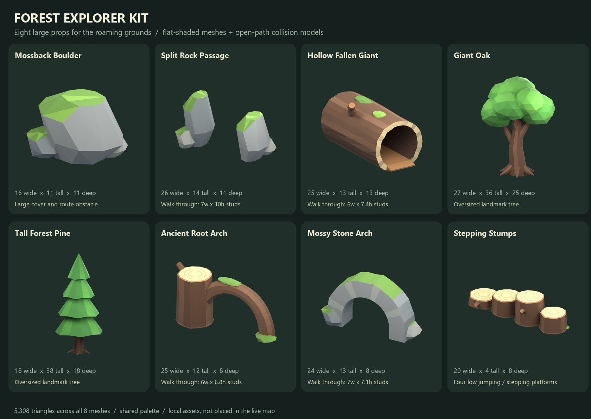

# Forest Explorer Kit

Eight large low-poly obstacles for the wild piggy roaming grounds. The palette
matches the existing meadow's grey stone, green moss, warm bark, and broad
faceted foliage. All pieces are original Blender geometry made for this kit.



| Asset folder | What it adds |
|---|---|
| `moss-boulder/` | Large moss-capped rock with two low shoulders for cover |
| `split-rock-passage/` | Two towering rocks with a seven-stud-wide path between them |
| `hollow-log/` | A round fallen trunk, open end to end, with a six-stud-wide interior route and low entry ramps |
| `giant-oak/` | Oversized branching oak with buttress roots and a broad faceted canopy |
| `giant-pine/` | Tall evergreen landmark with four chunky foliage tiers |
| `root-arch/` | A cut ancient stump and a large curved root forming a walk-through arch |
| `stone-arch/` | Mossy natural stone arch with open space beneath |
| `stepping-stumps/` | Four wood platforms, 1.5, 3, 4.5, and 3 studs high |

Every asset folder contains a `.blend`, a visual `.fbx`, `manifest.json`,
`collision.rbxmx`, and transparent preview renders. Walk-through pieces also
have straight-on opening renders. Blender files have packed textures and
preview cameras/lights; FBXs contain only the named visual mesh.

## Materials and scale

All eight models share `forest-palette.png`, a 512 x 32 atlas of plain colors.
It contains no photographic texture, normal maps, or baked lighting. Flat
face normals provide the facets. Set the imported MeshPart's Color to white
when using the palette as TextureID or ColorMap.

The manifest dimensions and collision positions are in **Roblox studs**.
Blender source coordinates convert `(x, y, z)` to `(x, -z, y)`; FBX export
uses scale 0.01, matching the existing meadow pipeline. Validate the actual
Studio import against `dimensions_studs` and `bounds_studs`; do not assume
the importer chose the desired scale. The Blender reimport check accounts
for this 0.01 export scale.

Each asset uses a ground anchor at `(0,0,0)`. Some roots and buried rock bases
extend slightly below that plane. This keeps them seated in the ground.

## Open passages and collisions

**Disable CanCollide on each visual MeshPart and use the supplied collision
model.** A default convex collision hull can fill the hollow log or an arch.
The collision models use anchored transparent Parts, with a noncolliding
`Origin` PrimaryPart at the same ground anchor as the visual geometry.

| Route | Clear width | Clear standing height | Interior floor |
|---|---:|---:|---:|
| Split rock passage | 7 | 10 | 0 |
| Hollow log | 6 | 7.4 | 0.65, with entry ramps |
| Root arch | 6 | 6.8 | 0 |
| Stone arch | 7 | 7.1 | 0 |

These envelopes were designed around a reference character 3.5 studs wide
and 5.8 studs tall. `validation.json` checks the stated route with a grid of
ray casts against the visible triangles and oriented collision boxes.
This is an offline geometry check, not a live character traversal test.

To assemble an asset in Studio:

1. Import the visual FBX and apply the shared palette. Match its size and
   orientation to the manifest, preserving the ground anchor.
2. Insert its `collision.rbxmx`. Keep the collision model's Origin as the
   assembled model's pivot. Parent the visible mesh under this model.
3. If Studio recenters the visual MeshPart, its intended local position is
   the midpoint of `bounds_studs.min` and `bounds_studs.max`; its intended
   Size is `dimensions_studs`. Match orientation using the preview and the
   recorded passage axis. Move the whole model with its Origin.
4. Scale the whole assembly together. Shrinking a passage shrinks the listed
   clearance; keep these route pieces near their authored size.
5. Walk through the log and arches with the actual player and a carried piggy
   before enabling them in the roaming area.

The log's inner floor is flat and its entrances have gentle low thresholds.
The arch colliders follow the curved roof and side supports. The giant trees
have trunk/root collisions only, keeping the decorative canopy inexpensive.
The stump colliders are inset, flat-topped blocks for predictable footing.

## Placement guidance

Use a few large landmarks among the existing small meadow props. Leave open
lanes between obstacles so auto-targeting and piggy chases stay readable.
Place the oak or pine behind clearings, the boulder beside a route, and the
arches/log across routes with clear space beyond both exits. Keep stepping
stumps away from the main pursuit lane so jumping remains optional.

Live integration must extend meadow obstacle reservations and herd movement:
the current MeadowBuilder treats its old rocks as blocked circular footprints.
Do not mark an entire hollow log or arch footprint as blocked, or AI movement
will avoid the passage despite the open collision. Reserve solids and keep
the marked passage corridor clear. Respect the existing pond, waterfall,
stream, tree, and border clearances in MeadowPlan/MeadowBuilder.

## Validation and delivery status

`validation.json` records triangle counts, closed manifold surfaces, nonzero
triangles, flat shading, palette/UV presence, FBX dimensions, and passage
clearance checks. `catalog.json` holds the full geometry/collision metadata.
`forest-obstacles.zip` is the portable source and import package.

These assets are **local, not uploaded and not placed in the live map**.
The existing meadow code, templates, assets, and placement were not changed.

## Rebuild

From the repository root:

```powershell
& 'C:\Program Files\Blender Foundation\Blender 5.2\blender.exe' --background --python-exit-code 1 --python assets/environment/forest-obstacles/generate/build_forest.py
& 'C:\Program Files\Blender Foundation\Blender 5.2\blender.exe' --background --python-exit-code 1 --python assets/environment/forest-obstacles/generate/verify_forest.py
python assets/environment/forest-obstacles/generate/finish_package.py
```

Append `-- hollow-log` (or another folder key) to the builder command to
regenerate one asset. The package script uses Pillow for its review sheet.
