# Blender guard preview

These are renders of the actual rigged meshes. The approved generated concepts are in `concepts/`. Starter motions still need gameplay tuning.

## Scruffy

[Open Blender scene](terrier/terrier.blend) · [Base FBX](terrier/terrier.fbx)

| Idle | Chase expression |
|---|---|
| 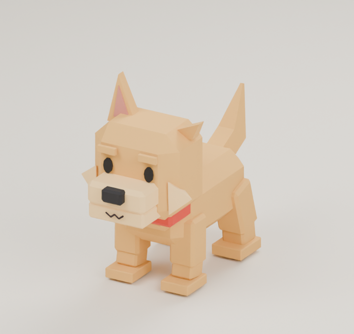 | 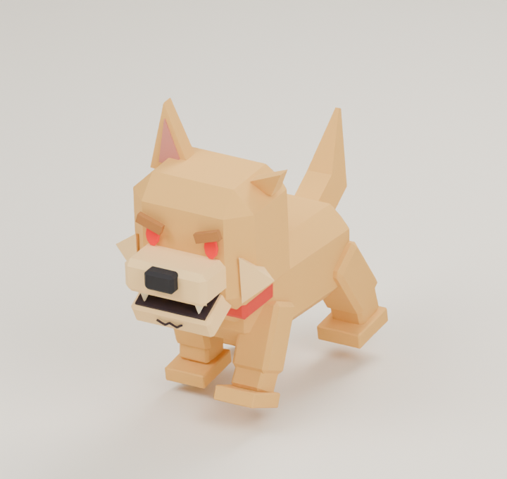 |

## Rex

[Open Blender scene](shepherd/shepherd.blend) · [Base FBX](shepherd/shepherd.fbx)

| Idle | Chase expression |
|---|---|
| 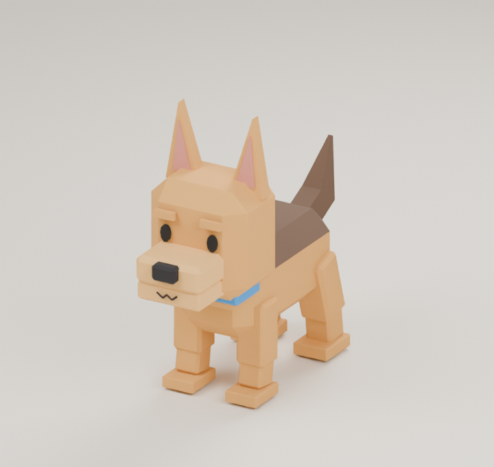 | 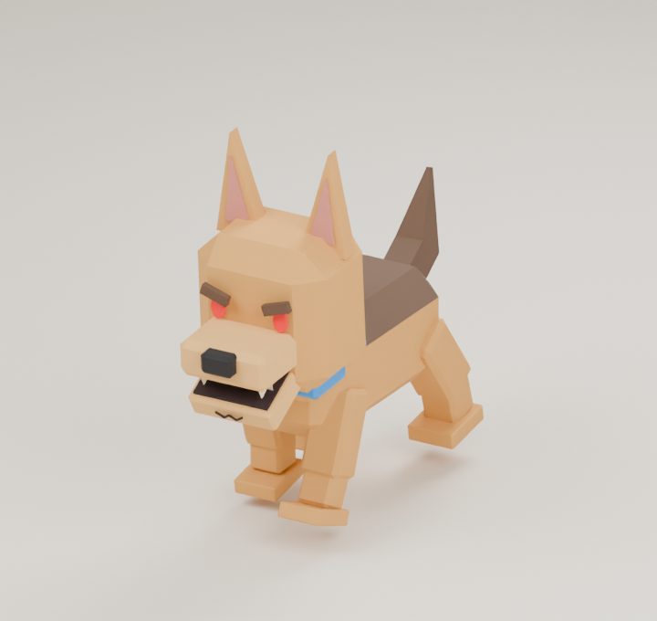 |

## Titan

[Open Blender scene](mastiff/mastiff.blend) · [Base FBX](mastiff/mastiff.fbx)

| Idle | Chase expression |
|---|---|
| 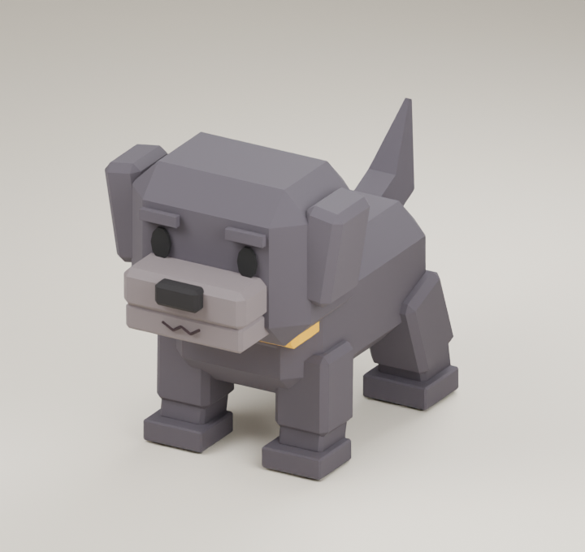 | 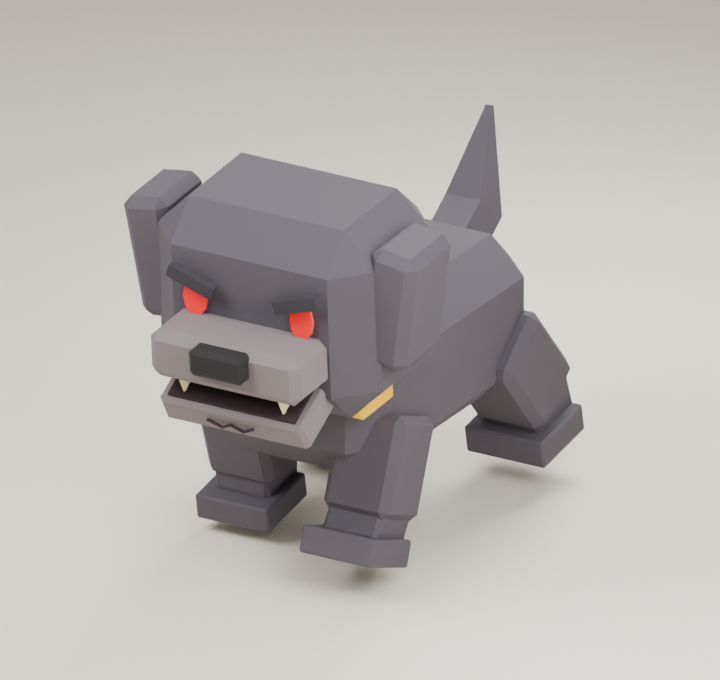 |

## Dire Wolf

[Open Blender scene](direwolf/direwolf.blend) · [Base FBX](direwolf/direwolf.fbx)

| Idle | Chase expression |
|---|---|
| 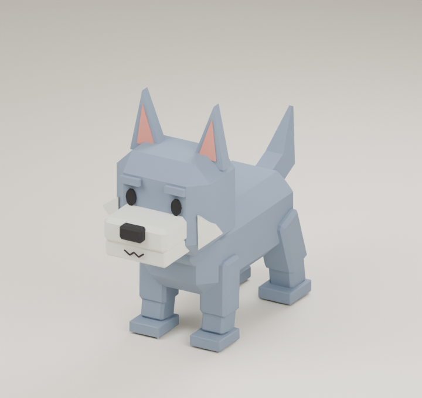 | 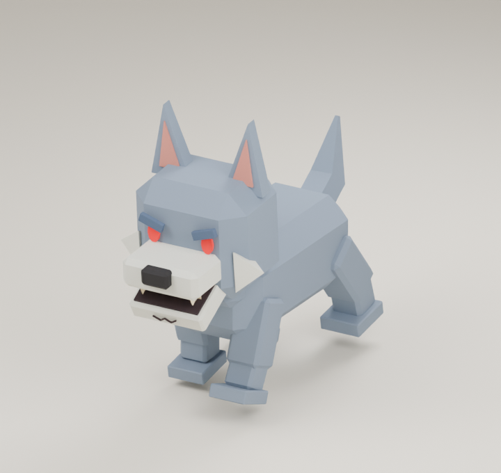 |

## Gorilla

[Open Blender scene](gorilla/gorilla.blend) · [Base FBX](gorilla/gorilla.fbx)

| Idle | Chase expression |
|---|---|
| 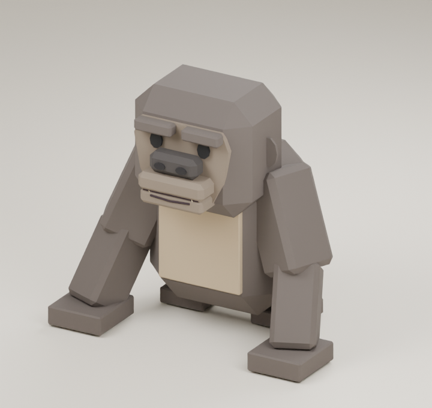 | 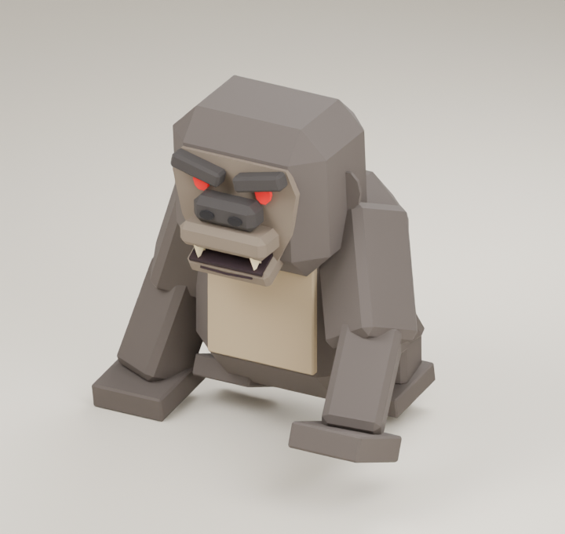 |

## Raptor

[Open Blender scene](raptor/raptor.blend) · [Base FBX](raptor/raptor.fbx)

| Idle | Chase expression |
|---|---|
| 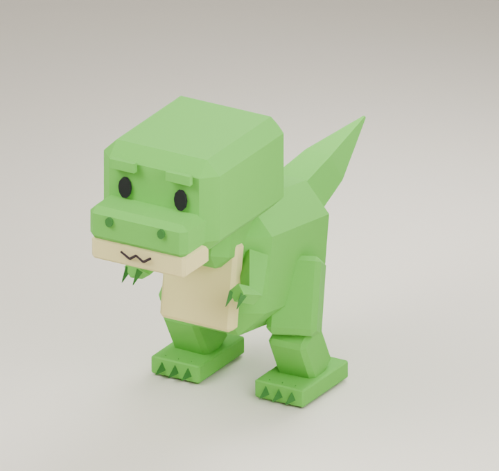 | 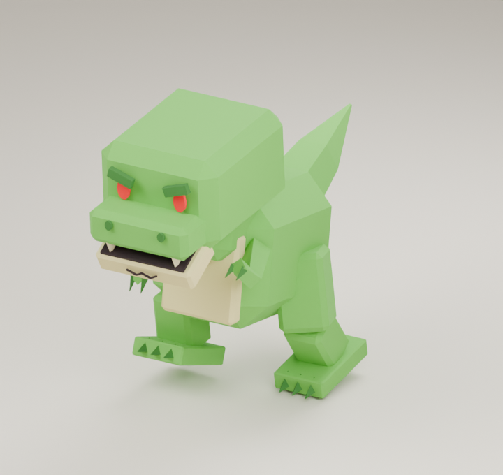 |

## Triceratops

[Open Blender scene](triceratops/triceratops.blend) · [Base FBX](triceratops/triceratops.fbx)

| Idle | Chase expression |
|---|---|
| 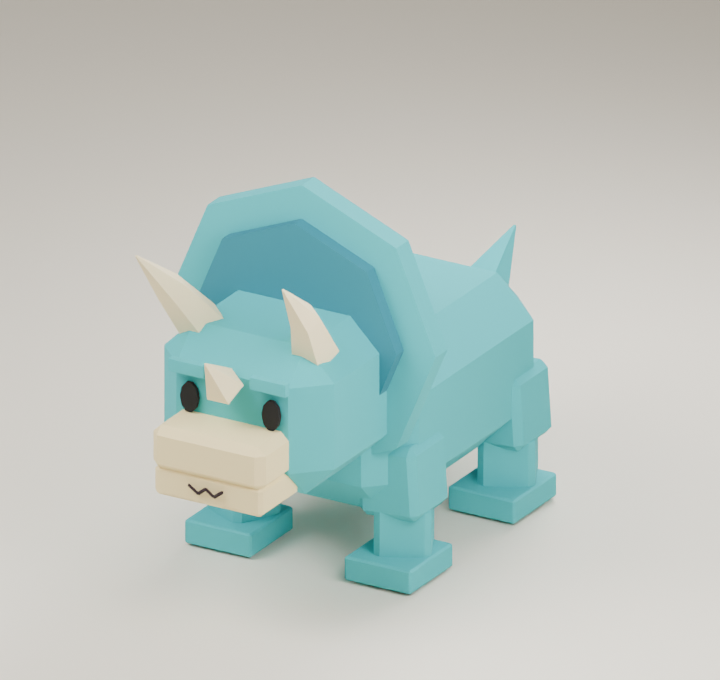 | 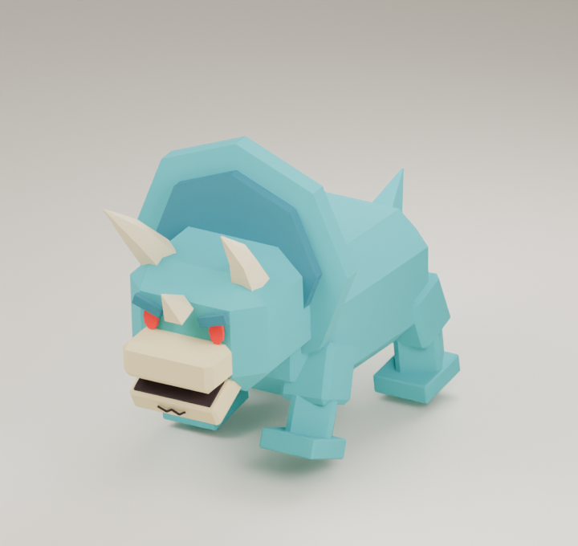 |

## Cerberus

[Open Blender scene](cerberus/cerberus.blend) · [Base FBX](cerberus/cerberus.fbx)

| Idle | Chase expression |
|---|---|
| 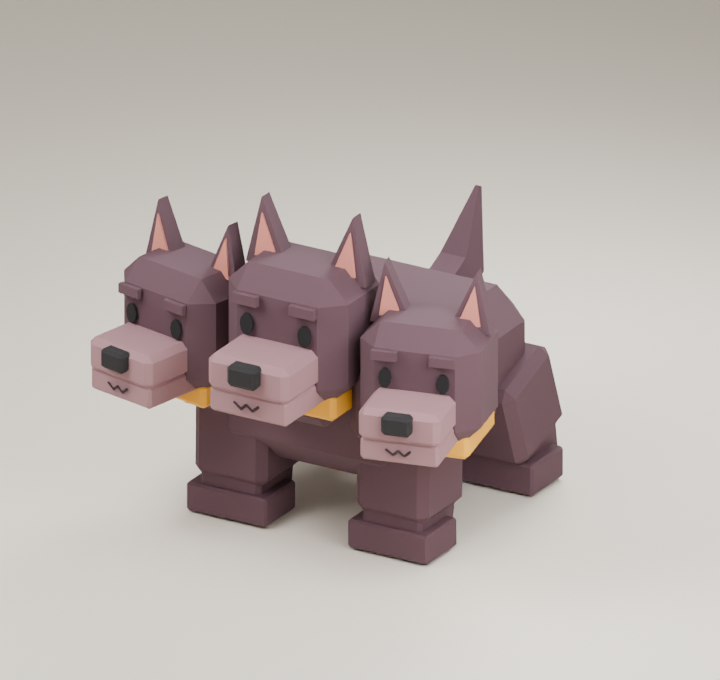 | 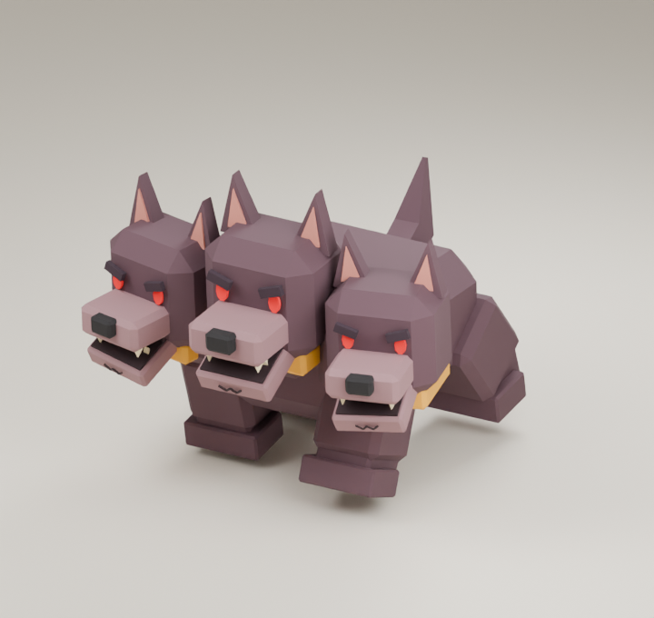 |
