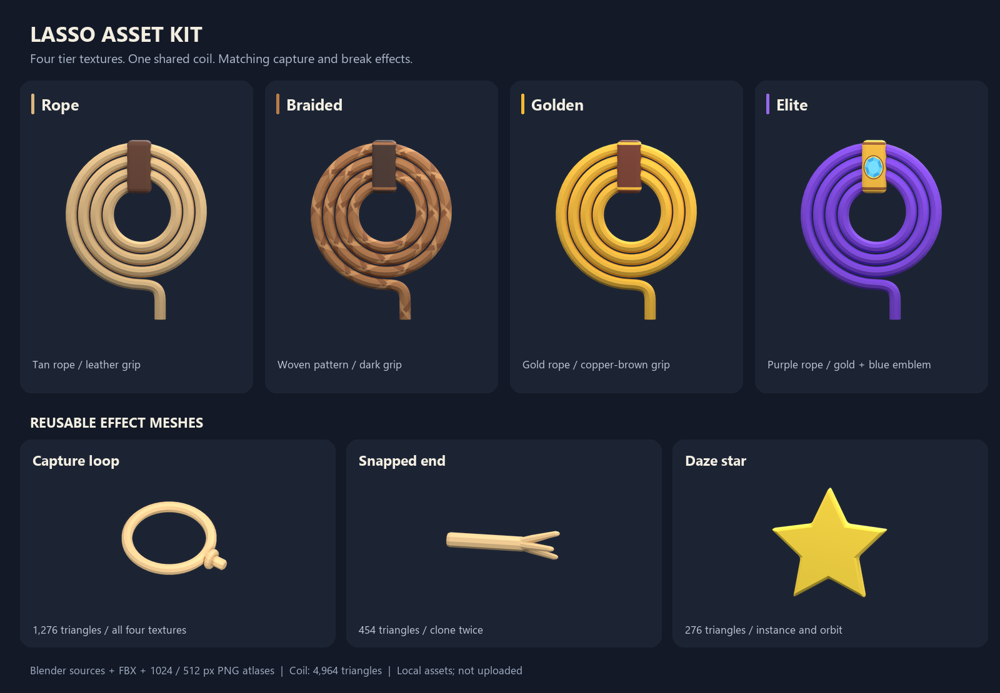

# Lasso asset kit

Four finished prop meshes and four tier texture looks. The designer's latest
direction is one shared coil for **Rope, Braided, Golden, and Elite**. Elite
uses a different texture; it does not require another mesh upload.



## Production files

| Asset | Blender source | Roblox FBX | Triangles |
|---|---|---|---:|
| Shared coil, two parts | `coil/coil.blend` | `coil/coil.fbx` | 4,964 |
| Capture loop | `loop/loop.blend` | `loop/loop.fbx` | 1,276 |
| Snapped rope end | `snapped-end/snapped-end.blend` | `snapped-end/snapped-end.fbx` | 454 |
| Reusable daze star | `daze-star/daze-star.blend` | `daze-star/daze-star.fbx` | 276 |

The coil contains `Rope` and `Grip`; the effects contain `Loop`, `SnappedEnd`,
and `Star`. Per-part FBXs are in each asset's `parts/` folder. The shared
coil, loop, and broken end have UVs for the same four atlases. The star uses
a plain yellow material and needs no image upload.

| Tier | Base-color atlas | Appearance |
|---|---|---|
| Rope | `textures/rope.png` | Plain tan rope and brown leather grip |
| Braided | `textures/braided.png` | Broad woven pattern and dark brown grip |
| Golden | `textures/golden.png` | Gold rope and copper-brown grip with gold ends |
| Elite | `textures/elite.png` | Royal purple rope, gold grip, printed blue emblem |

Each map is a 1024 x 1024 RGB PNG; `*-512.png` versions use the identical UV
layout. These are base-color maps with no baked lighting or photographic
fibres, and no normal/roughness/metalness images are required. Both coil
parts use the **same** atlas. Change the texture on both parts together.

`tiers/rope.blend`, `braided.blend`, `golden.blend`, and `elite.blend` show
the four finished looks with packed textures. Their mesh geometry and UVs
are identical. These are authoring previews of one shared asset.

## Import and placement

1. Import the four production FBXs with Studio's 3D Importer, preserving the
   coil's two parts. Meshes are flat-shaded and exported Y-up.
2. Assign the chosen tier atlas as `TextureID` or `SurfaceAppearance.ColorMap`
   to the coil parts, loop, and broken end. Set MeshPart `Color` to white
   `(255,255,255)` so it does not multiply and darken the map. The supplied
   default FBXs refer to the Rope atlas.
3. Read each asset's `manifest.json` for dimensions, origin, and attachment
   coordinates. Scale attachment positions with the model. FBX exports have
   shared assembly origins; separately imported MeshParts may be recentered
   by Studio, so reconstruct placement from the part bounds in
   `validation.json` if
   importing individual files. Prefer the assembled coil FBX.
4. The coil's `HandGrip` sits at the top band. Match it to the character's
   right hand. `RopeExit` marks the tail or loop stub. The recorded HandGrip
   frame uses the model's axes; final hand orientation needs the R15 pose.
5. Scale the loop from its **opening centre**, not its knot-inclusive bounds.
   Its unscaled inner diameter is 1.46. Fit to the piggy torso plus clearance.
   The Beam supplies the long rope and should use the tier's rope colour.
6. Clone `SnappedEnd` twice and rotate one for the miss effect. Clone `Star`
   three to five times and animate the orbit and fade in code.

Rope U coordinates intentionally repeat beyond 0..1. Preserve them on import;
the atlas tiles horizontally. For shops, `preview/*-64.png` and the full
`tiers/preview/*.png` renders are supplied.

## Validation and remaining work

`validation.json` records saved-source and FBX round-trip checks: closed
manifold edges, positive volume, nonzero faces, flat normals, material/UV
presence, triangle counts, per-part placement, and identical tier geometry.
`preview/thumbnail-check.png` shows the four looks at actual 64-pixel size.

The kit is **local source art, not uploaded or integrated**. Live in-hand
fit, closure around piggies, and the gameplay animation/Beam transitions
still need a Studio integration pass. Character animations are outside this
mesh/texture package.

The original plain-color coil remains in `rope/`. A decorative Elite mesh
built before the texture-only direction is retained in
`alternates/elite-sculpted/`; it is excluded from the production package.

## Rebuild

From the repository root, with Blender 5.2 installed:

```powershell
& 'C:\Program Files\Blender Foundation\Blender 5.2\blender.exe' --background --python-exit-code 1 --python assets/lassos/generate/build_set.py
python assets/lassos/generate/paint_tiers.py
& 'C:\Program Files\Blender Foundation\Blender 5.2\blender.exe' --background --python-exit-code 1 --python assets/lassos/generate/texture_set.py
& 'C:\Program Files\Blender Foundation\Blender 5.2\blender.exe' --background --python-exit-code 1 --python assets/lassos/generate/verify_set.py
python assets/lassos/generate/make_review.py
```

`build_set.py` reuses `rope/lasso-rope.blend`; its original generator lives
in `rope/generate/build_lasso.py` if a completely fresh source is needed.
