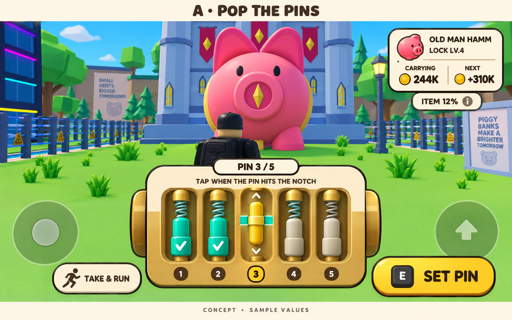
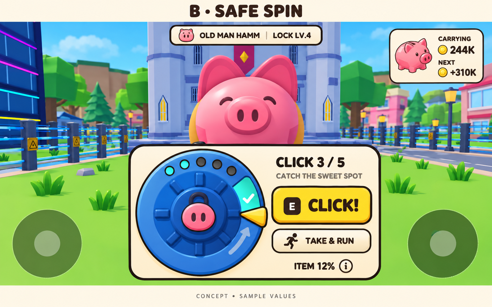
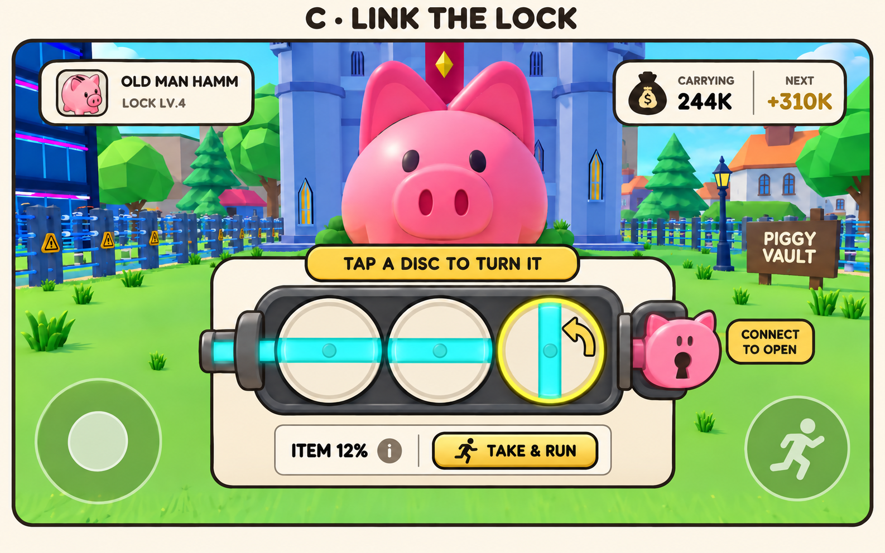

# Lock-cracking GUI concepts

Brainstorming only; no game scripts or economy rules changed. Generated with
the built-in image_gen tool. Full prompt set: [prompts.json](prompts.json).
Images use sample values and enlarged mechanisms to communicate the concepts;
they are not exact mobile layouts or replacements for the game's world assets.

## A — Pop the Pins (recommended)

One spring-loaded pin moves at a time. Tap the large SET PIN control when its
collar crosses the notch. The pin snaps into place with a short click and check
mark; the next starts immediately. Each pin corresponds to one existing robbery
step, not five extra actions inside each step. TAKE & RUN preserves the current
choice to leave with the haul rather than attempt the next, riskier step.

- Five visible pins make progress physical and easy to read.
- Proposed target: roughly 6–10 seconds for a clean full run, to be tuned in play.
- Vary notch heights and timing within readable bounds; keep the input familiar.
- Lock tiers/pick upgrades can map to the existing timing-window rules.
- Use tiny snaps, distinct click pitches and a quick loot-number tick; avoid
  long celebration animations between steps.
- Miss/alarm/loss rules should stay consistent with the existing heist system
  unless a later design decision explicitly changes them.

This is the closest fit to the existing server-validated moving-marker system
in Crack/HeistService, with a much stronger visual identity.

## B — Safe Spin

A pointer circles the safe dial; tap CLICK when it enters the marked arc. Each
successful catch seats a latch and increases the carried haul. Five catches can
map directly to the existing five robbery steps. The rotating mechanism offers
a compact visual alternative to the linear timing bar, with one thumb control.

Its weakness is that it changes the feel and presentation more than the core
timing game. Best if speed and immediate familiarity matter more than novelty.

## C — Link the Lock

Tap large discs to rotate their channels into a continuous path. The final
concept depicts a simple solvable state: first two channels horizontal, last
channel vertical. This needs no precise timing and introduces a different kind
of interaction. More advanced layouts would need authored, verified solutions.

Best reserved for special/store locks: a puzzle before every robbery could slow
down repeated play. Its reward/partial-progress mapping needs separate planning
before replacing the current timing mechanic; mockup cash-out is illustrative.

## Shared production direction

- Keep cream panels, dark cocoa outlines, yellow actions and low-poly toy forms.
- Compress the final phone UI into the lower center, preserving movement and
  jump areas. The review images deliberately enlarge mechanisms.
- Hide duplicate STEAL/SMASH prompts once cracking starts.
- Keep carried haul, next-step reward and item odds in one small readable strip.
  The info control can open the existing item/rarity breakdown.
- Keep cash-out distinct from the primary action. Never rely only on color:
  seated-pin checks, active outlines and notch shapes communicate states.
- Keep server authority over timing and rewards; cosmetic success feedback must
  follow accepted results, and client animation uses the shared time base.
- Do not add ads, paid retry prompts or forced reveal animations to the loop.

Recommendation: prototype A first with the current risk/reward rules. Compare
completion time, accidental taps, repeat enjoyment and visibility while moving
on an actual phone before committing to production art or alternate lock types.
