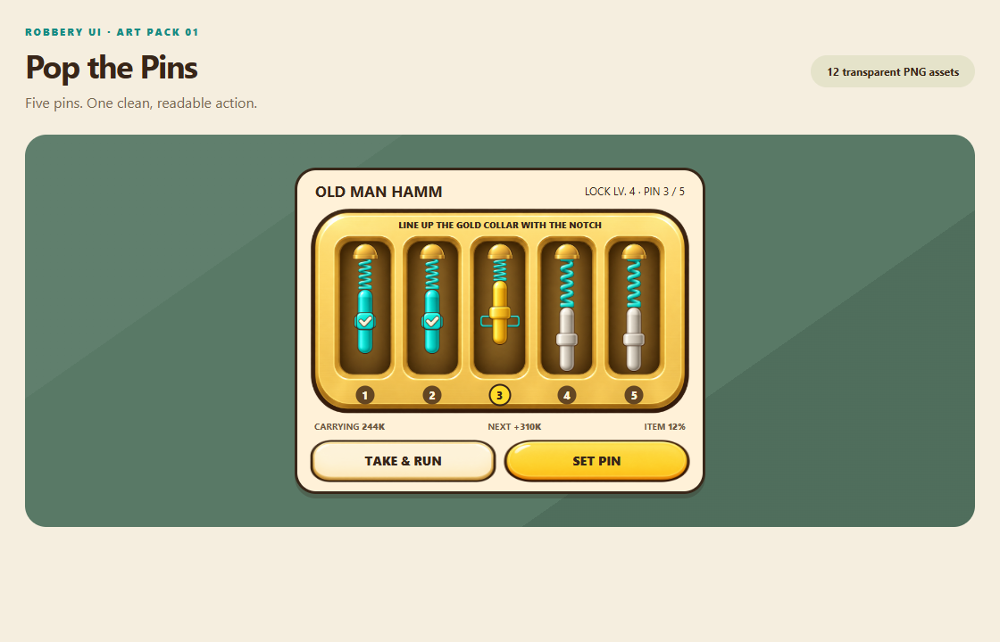

# Pop the Pins — UI asset kit v1

Twelve separate transparent PNGs for the approved five-pin lock concept. Created
with the built-in image_gen tool. The original PNG alpha is preserved.

**Start here:** open [preview.html](preview.html) in a browser. Use the position
slider to check pin travel, hold either button to see its pressed art, and toggle
the compact size. This is an art/layout preview, not a Roblox minigame.

## Files to import

Upload the PNGs in `sprites/` as your experience's UI image assets. Reuse the same
pin, spring and cap images across all five channels.

| Sprite | Purpose |
| --- | --- |
| `lock-housing.png` | Stationary gold housing with five empty recessed channels |
| `pin-idle.png` | Ivory pin before its turn |
| `pin-active.png` | Gold moving pin |
| `pin-set.png` | Turquoise completed pin |
| `spring.png` | Independent spring; resize vertically as the pin moves |
| `top-cap.png` | Fixed anchor above each spring |
| `target-notch.png` | Hollow turquoise target around the active collar |
| `success-check.png` | Completed-pin badge, layered over its collar |
| `button-primary.png` | Blank gold SET PIN background |
| `button-primary-pressed.png` | Pressed gold button background |
| `button-secondary.png` | Blank cream TAKE & RUN background |
| `button-secondary-pressed.png` | Pressed cream button background |

Text, pin numbers, the outer cream panel, and gameplay values are native UI in
the preview. They are intentionally not baked into the PNGs. Use your game's
existing typography and UI components when wiring the assets.

## Important: transparent padding and display rectangles

The originals retain the generator's canvas and padding. **Do not size the whole
uncropped canvas as if it were the visible shape**: that makes the art look small
and creates mismatched spacing.

`manifest.json` records the PNG dimensions and a `displayRectPixels` value for
every sprite: `[x, y, width, height]`. Use its first two values for
`ImageRectOffset`, and the last two for `ImageRectSize`, with
`BackgroundTransparency = 1`. These properties select a source-image region;
see the [official ImageLabel documentation](https://create.roblox.com/docs/reference/engine/classes/ImageLabel).

The pin variants deliberately share one display rectangle. Each pair of button
states also shares a rectangle; their illustrated bevels change on press.
`displayRectNormalized` supplies the same rectangle as fractions of the source
dimensions. If the uploaded texture's actual dimensions differ, multiply these
fractions by those dimensions instead of blindly using the original pixel values.

Keep the housing's displayed aspect ratio at **1470:799**. The preview intentionally
stretches the spring vertically; do not lock the spring's aspect ratio. Button
backgrounds can stretch modestly to match your layout. These are not calibrated
9-slice assets.

## Layer layout

All fractions below refer to the **displayed housing rectangle**, after applying
its source crop. Center each component horizontally on its channel. Vertical
positions use the top edge unless explicitly described as a center.

Channel center X positions: **0.145, 0.322, 0.499, 0.676, 0.853**.

| Layer | Width | Height | Position Y | Z order |
| --- | ---: | ---: | --- | ---: |
| Housing | 1 | 1 | 0 | 1 |
| Active target notch | 0.106 | 0.062 | Center 0.55 | 2 |
| Spring | 0.039 | Varies | Top 0.234; bottom pin top + 0.006 | 3 |
| Top cap | 0.068 | 0.080 | Top 0.17 | 4 |
| Pin | 0.060 | 0.316 | Top ranges 0.30–0.48 | 5 |
| Success badge | 0.049 | 0.088 | Center on pin collar | 6 |
| Native number badge | Native UI | Native UI | Center 0.905 | 7 |

The collar center is approximately halfway down the pin. For the sample target,
an aligned pin top is `0.55 - 0.316 * 0.5 = 0.392`. The sample shows two set pins,
one active pin, and two idle pins. Dimensions and layer data are also available
in machine-readable form in `manifest.json`.

The preview uses a 460-pixel-wide card and a 340-pixel compact example. These
illustrate asset readability; choose final placement after testing alongside
your movement, jump and hotbar controls in Studio. The small instructional and
reward text in the compact example may need increasing for the final HUD.

## Suggested state behavior for your implementation

1. Idle: ivory pin; no target or success badge.
2. Active: gold pin; target notch visible. Move the pin and resize its spring
   from the same animation value so their connection stays intact.
3. Set: stop the pin on the target; use turquoise art and add the check badge.
4. Advance to the next channel. One pin represents one robbery step.
5. Use your existing failure/cash-out rules and server validation. The artwork
   does not change loot odds, reward slices, timing windows or lock difficulty.

Keep SET PIN and TAKE & RUN labels live. The full button, rather than individual
pin artwork, should be the tap target. Avoid adding five extra pin interactions
inside every existing robbery step.

## Included previews and provenance

- `assembled-preview.png` — layout rendered from these exact sprites.
- `compact-preview.png` — smaller layout with the active pin at its lower limit.
- `asset-sheet-preview.png` — sprite catalog on a checkerboard transparency grid.
- `preview.html` + `manifest.js` — self-contained local art preview; no network or
  Roblox connection required. Keep the folder together.
- `source/prompts.json` — full prompts, style reference and generation provenance.
- `source/inspect_assets.py` — validates alpha/dimensions and writes the manifests;
  does not edit pixels.
- `source/render_preview.cjs` — local browser renderer used for the previews.
  Its executable/dependency paths refer to this machine.

## Validation and handoff

All 12 images were checked for RGBA transparency and valid display rectangles.
The assembled layout and checkerboard catalog were visually inspected. The
preview's pin slider and 390-pixel-wide page overflow check passed.

**Not yet uploaded to Roblox or tested in Studio.** There are no asset IDs or
runtime scripts in this kit. Import, gameplay wiring, final mobile placement,
and in-game texture-size checks are left for your implementation as requested.
