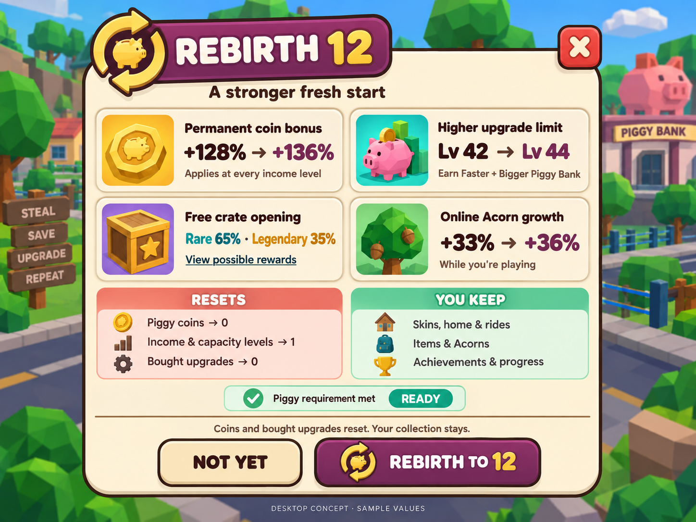
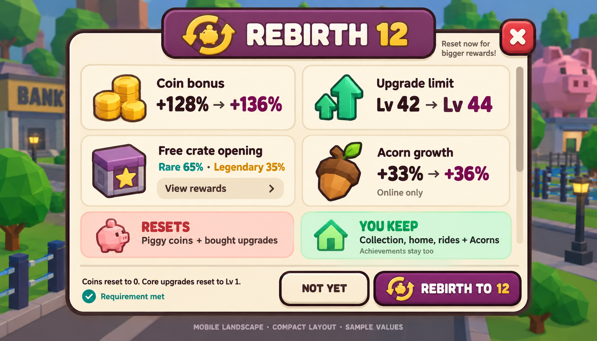
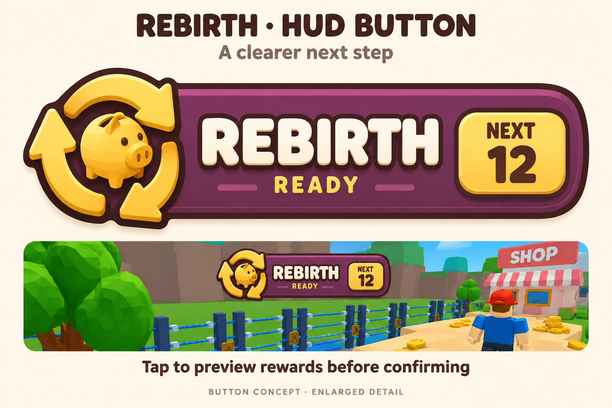

# Rebirth UI concepts v1

Generated using the built-in image_gen tool from the [redesign guide](../../../docs/REBIRTH-UI-REDESIGN.md).
These are concept images with sample data, not implemented Roblox screens or import-ready individual sprites.

## Desktop reward preview

Four benefit cards with current-to-next comparisons, crate odds, reset/keep summaries and explicit confirmation.

## Mobile landscape

Shorter labels and compact summaries with a separate confirmation footer. Final text sizing, safe areas and scrolling must be checked in Studio. This generated layout illustrates the hierarchy; it is not a pixel-validated phone layout.

## HUD button

Plum plaque, gold piggy-and-arrows emblem and NEXT badge. Enlarged to review the artwork; final HUD dimensions follow the guide. The generated button uses three arrow segments instead of the guide's proposed two; this remains a concept detail to refine when creating the production emblem.

The sample previews show rebirth 11 to 12: permanent income bonus +128% to +136%, core upgrade limit 42 to 44, and online Acorn growth bonus +33% to +36%. Crate odds shown are Rare 65% / Legendary 35%. Use live configuration/state in the implementation.

All three share an intended palette and hierarchy, but the illustrative icon variations should be consolidated into one production set. Background neighborhoods are illustrative, not actual Studio screenshots. No runtime scripts or game assets were replaced.

Full generation prompts and source provenance: [prompts.json](prompts.json).

## Reusable icon assets

The matching [rebirth icon pack](../rebirth-icons-v1/README.md) contains the Acorn
tree, a Classic Pink piggy based on the game model, its money variant, a complete
rebirth emblem, and a separate arrow layer for animation. Use these PNGs for the
build rather than extracting illustrations from the concept images.
